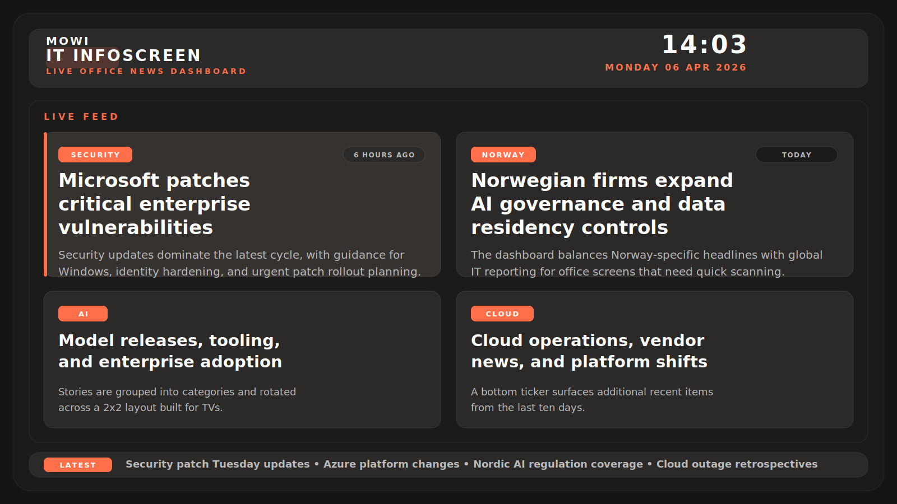

# IT News InfoScreen

Browser-based fullscreen IT news dashboard for office TVs, optimized for Norway-based teams with content in Norwegian and English. The current version builds as a static site for GitHub Pages while reusing the backend news aggregation pipeline during the build step.

## App Preview



## What It Does

- Aggregates IT news at build time using the existing backend feed logic.
- Can optionally rewrite each story with Gemini into short, easy, user-friendly text.
- Can optionally generate a matching story image with Gemini.
- Stops Gemini requests for the rest of the Oslo day if the daily AI quota is exhausted.
- Generates static JSON that the frontend reads directly in the browser.
- Renders a TV-friendly featured-story slider with a side queue, timestamps, QR codes, and optional story images.
- Shows a bottom ticker with recent stories from the last ten days.
- Reloads automatically at 03:30 Europe/Oslo after 24 hours of uptime.
- Deploys cleanly to GitHub Pages with scheduled refreshes.

## Stack

- `frontend/`: Vite + React dashboard UI
- `backend/`: Node-based source fetching, scraping, normalization, categorization, and optional AI enrichment
- `scripts/generate-static-news.mjs`: bridge that generates `frontend/public/data/news.json`
- `.github/workflows/deploy-pages.yml`: GitHub Pages deployment workflow

## Project Structure

```text
it-news-infoscreen/
  .github/workflows/
  backend/
    src/
      config/
      middleware/
      routes/
      services/
      utils/
  docs/
    app-preview.svg
  frontend/
    public/
      data/
      generated/
    src/
      components/
      hooks/
      utils/
  scripts/
  release/
```

## Install

```bash
cd C:\Repos\it-news-infoscreen
npm install
npm install --prefix backend
npm install --prefix frontend
```

## Build The Static Site

```bash
npm run build
```

This will:

- fetch and normalize the latest stories into `frontend/public/data/news.json`
- optionally generate Gemini summaries and Gemini images when the key is configured
- stop making Gemini calls for the rest of the Oslo day after a quota-exceeded response
- build the frontend into `frontend/dist`

## Preview Locally

```bash
npm run preview --prefix frontend
```

Open `http://localhost:4173/it-news-infoscreen/`

## Local Development

Run the backend and frontend together:

```bash
npm run dev
```

- Frontend dev server: `http://localhost:5173`
- Backend API: `http://localhost:8080`

## Deployment

The included workflow publishes the static site to:

- `https://tennetno.github.io/it-news-infoscreen/`

Deployment can be triggered by:

- push to `main`
- manual `workflow_dispatch`
- scheduled overnight rebuilds on weekdays at `01:00 UTC`

For Oslo time this is:

- `02:00` in winter
- `03:00` in summer

This overnight build is intended to prepare the full day's stories before business hours.

To enable GitHub Pages:

1. Push the repository to GitHub.
2. Open repository `Settings -> Pages`.
3. Set the source to `GitHub Actions`.
4. Push to `main` or run the workflow manually.

## Data Shape

The generated `frontend/public/data/news.json` file contains:

- `builtAt`
- `items`
- `sourceStats`

Each item contains:

- `id`
- `title`
- `source_name`
- `source_url`
- `published_at`
- `language`
- `category`
- `summary`
- `image_url`
- `qr_url`

## Optional AI Enrichment

Create `backend/.env` from `backend/.env.example` and set:

- `GEMINI_API_KEY`

Optional tuning:

- `GEMINI_SUMMARY_MODEL`
- `GEMINI_IMAGE_MODEL`
- `AI_ENRICH_MAX_ITEMS`
- `AI_ENRICH_CONCURRENCY`

Behavior:

- Gemini rewrites story summaries into plain, short office-friendly text.
- Gemini generates one image per story and saves it to `frontend/public/generated/news-images/`.
- Generated summaries and image metadata are cached in `backend/.cache/ai/` so unchanged stories are not regenerated every build.
- If Gemini returns a quota-exceeded response, the app records that and skips the remaining Gemini requests until the next Oslo day.
- If the Gemini key is missing, the app falls back to the original summaries and shows no generated images.

## Source Configuration

Update `backend/src/config/sources.json`, then rebuild:

```bash
npm run build
```

## Notes

- GitHub Pages is static-only, so server-side cookie authentication is not used in the deployed version.
- The backend still lives in the repository and is reused during builds to generate static news data.
- For office-TV usage, open the deployed URL in the browser and enable fullscreen or kiosk mode.
